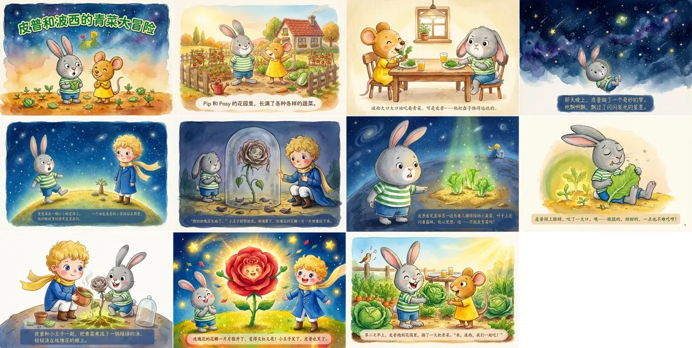

# 📖 Storybook - AI 儿童绘本生成系统

基于 AI 的儿童绘本自动生成系统。从故事主题出发，自动完成角色设计、分镜脚本、Prompt 编写、角色参考图生成、逐页插画生成，输出一本完整的绘本。


## 💡 背景

如何把 AI 用在日常生活场景？比如育儿场景：给娃定制绘本，改掉坏习惯。
绘本风格：皮普和波西，支持指定年龄段；Codebuddy+NanoBanana2

## 🚀 安装

```bash
git clone git@github.com:ForrestSu/storybook-skills.git
cd storybook
npm install
```

## 🎨 使用

本项目包含两个 Skill，在 CodeBuddy Code 中通过斜杠命令调用。

### `/storybook` - 生成绘本 ✨

```
/storybook 我4岁女儿最近不爱刷牙，结合 @prototype/pip-and-posy 里的角色图和故事模式帮我设计一个绘本，让她可以对刷牙感兴趣。
/storybook 防止我4岁女儿近视，结合 @prototype/pip-and-posy 里的角色图和故事模式帮我设计一个绘本，让她少看IPAD和电视，结合小王子
/storybook 我4岁女儿不爱吃绿色的青菜，结合 @prototype/pip-and-posy 里的角色图和故事模式帮我设计一个绘本，让她爱上吃青菜，结合小王子。
```

**生成效果✨：**



**📂 生成结果：**

```
storybook/{slug}-{timestamp}/
├── characters/
│   ├── characters.md       # 角色定义
│   └── characters.jpeg     # 角色参考图
├── storyboard.md           # 分镜脚本
├── prompts/
│   ├── 00-cover.md         # 封面 Prompt
│   └── 01-page.md ~ ...    # 各页 Prompt
├── 00-cover.png ~ ...      # 页面插画
└── all-pages.png           # 网格图预览
```

### `/refine` - 精调页面 🔧

对已生成的页面做局部修改，无需重新生成整本书：

```
/refine storybook/fox-story-0315/03-page.jpeg 小兔子表情应该更开心，嘴角上扬
```

系统会自动找到角色参考图和原始 Prompt，基于原图 + 修改指令重新生成。不满意可以继续迭代，满意后覆盖原图。
